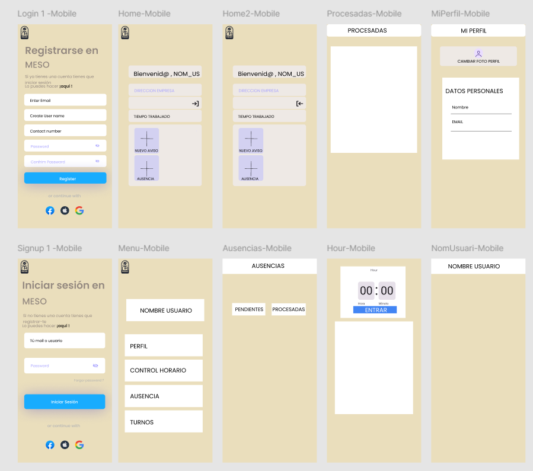

# Projecte_ACT1_WF

**SPRINT 1**
_________________________________________________________________________________________________________________________

**WireFrame DAM:**



Login 1 - Mobile:

Esta pantalla permite a los usuarios registrarse en la aplicación "MESO".
Incluye campos de entrada para: correo electrónico, nombre de usuario, número de contacto, contraseña y confirmación de contraseña.
Tiene un botón azul para "Registrar".
También incluye opciones de registro rápido con Facebook, Google y Twitter en la parte inferior.

Signup 1 - Mobile:

Esta pantalla es la de inicio de sesión en "MESO".
Incluye campos para ingresar el correo electrónico o nombre de usuario y la contraseña.
Tiene un botón de "Iniciar Sesión" en azul.
Al igual que la pantalla de registro, ofrece opciones de inicio de sesión con Facebook, Google y Twitter.

Home - Mobile:

Pantalla de bienvenida al usuario, mostrando "Bienvenid@, _NOM_US".
Incluye el texto "DIRECCION EMPRESA" y una sección para ver el "TIEMPO TRABAJADO".
Tiene dos botones destacados: uno para "Nuevo aviso" y otro para "Ausencia", el usuario utilizará para informar.

Home2 - Mobile:

Esta pantalla sirve para volver a la anterior 

Menu - Mobile:

Esta pantalla muestra el menú principal de la aplicación.
Contiene opciones para acceder a diferentes secciones: "Perfil", "Control Horario", "Ausencia" y "Turnos", junto con el nombre de usuario en la parte superior.

Ausencias - Mobile:

Pantalla para gestionar las ausencias de los usuarios.
Tiene dos secciones principales: "Pendientes" y "Procesadas" para facilitar la organización y revisión de las ausencias, para ver las faltas justificadas o no, o las que aún se stán decidiendo. 

Procesadas - Mobile:

Pantalla dedicada a mostrar las ausencias que ya han sido "Procesadas".
Muestra las que se han justificado o no.

Hour - Mobile:

Pantalla para gestionar o visualizar el "Control Horario".
Muestra un reloj digital (00:00) en formato de horas y minutos, con un botón "Entrar" debajo.
Con esta pantalla el usuario podrá gestionar las entradas al trabajo. 

MiPerfil - Mobile:

Pantalla de perfil de usuario donde se pueden gestionar los datos personales.
Incluye un botón para cambiar la foto de perfil y campos para editar el nombre y el correo electrónico.

NomUsuari - Mobile:

Pantalla simple que muestra solo el nombre de usuario en la parte superior y se puede editar.

**WireFrame DAW:**


Inicio de sesión (Login): Incluye un formulario para que el cliente pueda ingresar su correo electrónico y su contraseña, tiene opciones para iniciar sesión con redes sociales.

Registro (Sign Up): Es muy similar a la pantalla de inicio de sesión, le permite al usuario registrarse ingresando su correo, contraseña y confirmación de contraseña. También incluye opciones para registrarse mediante redes sociales.

Pantallas Principales:

Principal 1 - Entradas: Pantalla que le da la bienvenida al usuario. Incluye accesos directos a opciones de "Entrada" y "Salida" para que el cliente pueda registrar la entrada o salida del trabajador.
Principal 2 - Entradas: Similar a la anterior, pero la unica diferecnia sera que este pantalla sera para que el trabajador pueda salir de su trabajo

Menú:
Muestra un menú lateral con opciones como Perfil, Control de Horario, Ausencia y Turnos. Estas opciones navegan a diferentes partes de la pagina web.

Perfil: Sección donde el trabajdor puede ver su perfil, cambiar su foto y ver información personal tales como su nombre y correo electrónico.

Control de Horario: Pantalla donde el trabajador puede marcar la hora de entrada o salida utilizando un temporizador y un botón Entrar.

Turnos: Pantalla que muestra el nombre del usuario y de su turno

Ausencia: Sección que permite al trabajdor ver y gestionar sus ausencias, donde le aparecen las asusencias Pendientes y las Procesadas.
Ausencias Procesadas: Pantalla específica para ver las ausencias ya procesadas y sera ahi donde apareceran las que han sido aprobadas por recursos humanos o las que han sido denegadas

**SPRINT 2**
_________________________________________________________________________________________________________________________

**Diseño base de datos:**

Relacion Persona( (ID_Persona), Nombre, Apellido, Cargo, Departamento, Tipo de usuario)
Consulta : 
Lista de todas las personas con el cargo que pertenecen y tambien con sy departamento . 
```sql
  SELECT Nombre, Apellido, Cargo, Departamento
  FROM Persona;
```

Registro ((ID_Registro), Fecha, Entrada/Salida, ID_Persona(FK), ID_Espacio(FK))
Consulta : 
Obtengo los registros de entrada y salida de una persona : 

```sql
  SELECT r.ID_Registro, r.Fecha, r.Entrada_Salida, p.Nombre, p.Apellido
  FROM Registro r
  JOIN Persona p ON r.ID_Persona = p.ID_Persona
  WHERE p.Nombre = 'NombreDeLaPersona' AND p.Apellido = 'ApellidoDeLaPersona';
```


Organizacion((ID_Organizacion), Nombre, Direccion, Tipo_Organizacion)
Consulta : 
Lista de organizaciones y numero de personas que pertenecen a una empresa : 
  ```sql
    SELECT o.Nombre AS Organizacion, COUNT(p.ID_Persona) AS Numero_Personas
    FROM Organizacion o
    JOIN Persona p ON o.ID_Organizacion = p.ID_Organizacion
    GROUP BY o.Nombre;
```


**SPRINT 3**
_________________________________________________________________________________________________________________________

**Prototip de alta fidelidad web (Sprint 2):**


En el prototipo de alta fidelidad ha habido algunos cambios, tanto en las páginas como en funcionalidades nuevas. Todo lo relacionado con el diseño se presentará en la guía de estilos. Vamos página por página.

Páginas excistentes editadas:

Principal1-Entradas:

1.- Se ha añadido el botón en rojo "Administrador", un botón que solo está activo en caso de que el perfil esté registrado como administrador dentro de la base de datos.

2.- Al lado de los botones de "Nuevo Aviso" y "Ausencia" se ha añadido los campos descriptivos para explicar el asunto y enviarlo.

CONTROL HORARIO:

1.-Se ha añadido al botón "Entrar" la opción de "Salir" para poder marcar las entradas y salidas.

Nuevas páginas:

Se han añadido algunas páginas nuevas para los administradores, no todos, ya que dirigirán a las mismas paginas, en otras ocasiones se enviarán a páginas parecidas pero con alguna modificación. 

Menu-Admin:
Esta página es para que el administrador seleccione un empleado y pueda ver todo lo que esta relacionado con él.

CONTROL HORARIO-Admin:
Sirve para entrar a ver las entradas y salidas pero el administrador no puede modificar las entradas y salidas.

AUSENCIAS PENDIENTES:
Muestra las ausencias que quedan por decidirse si se han justificado o no.

**Prototip de alta fidelidad móbil (Sprint 2):**


Proba2